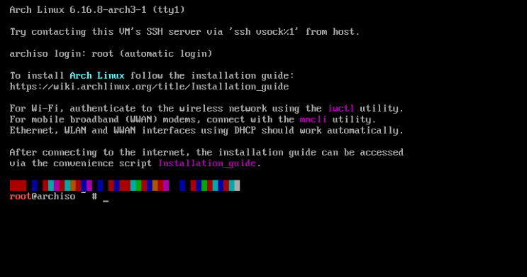

# Installation of Arch Linux

First of all you need a bootable USB stick.First download the iso file from [arch downloads](https://archlinux.org/download/) and then burn it to a USB stick using something like balenaEtcher.


<br>
<br>
<br>

## Booting Arch Linux

Boot the USB stick and select the Arch Linux installation medium.

<br>
<br>

### Disable Secure Boot 
Arch Linux installation images do not support Secure Boot. You will need to [disable Secure Boot](https://wiki.archlinux.org/title/Unified_Extensible_Firmware_Interface/Secure_Boot#Disabling_Secure_Boot) to boot the installation medium. If desired, Secure Boot can be set up after completing the installation.

After booting the installation medium, you will be prompted to select the installation type, 

<br>

- If you used the ISO, select Arch Linux install medium and press Enter to enter the installation environment.

- If you used the Netboot image, choose a geographically close mirror from Mirror menu, then select Boot Arch Linux and press Enter. 

<br>
now selecting the first one will give you this menu 

<br>
<br>



If you see this, congratulations, you are halfway getting back pain .

<br>
<br>
<br>

## Setting up the installation environment

Now you will be prompted to set up the installation environment.

<br>

### Setting up the keyboard layout


The default keyboard layout is set to the United States layout. If you want to change the keyboard layout, you can do so by running the following command:

First, run the following command to list the available keyboard layouts:

```bash
ls /usr/share/kbd/keymaps/**/*.map.gz
```
You can search for the layout you want to use by running the grep command, for example:

```bash
grep -i "de-latin1" /usr/share/kbd/keymaps/**/*.map.gz
```


Now if you wanna change the layout to latin you can just do this 

```bash
loadkeys de-latin1
```


<br>
<br>
<br>

### Setting up the fonts


<br>

Arch Linux uses the DejaVu Sans font by default. If you want to change the font, you can do so by running the following command , console fonts are located in `/usr/share/kbd/consolefonts/` and can likewise be set with `setfont(8)` omitting the path and file extension. For example, to use one of the largest fonts suitable for HiDPI screens, run:

```bash
setfont ter-132b
```


<br>
<br>

### Updating the system clock
In the live environment [systemd-timesyncd](https://wiki.archlinux.org/title/Systemd-timesyncd) is enabled by default and time will be synced automatically once a connection to the internet is established, we will set up the internet connection soon. 

```bash
timedatectl
```


<br>
<br>


## Partitioning the disk


<br>
<br>

### Check if you have a UEFI system

Now in this step you have to check what type of system you are in, some steps are different for UEFI and non-UEFI systems.You should verify if you have UEFI enabled system or not. Use this command:


```bash
ls /usr/firmware/efi/efivars
```

If this directory exists, you have a UEFI enabled system. You should follow the steps for UEFI system. The steps that differ are clearly mentioned.

<br>
<br>


### EFI Partition (Only for UEFI systems)

If you have a **UEFI system**, you must create an **EFI partition at the beginning of your disk**. Otherwise, skip this step.


